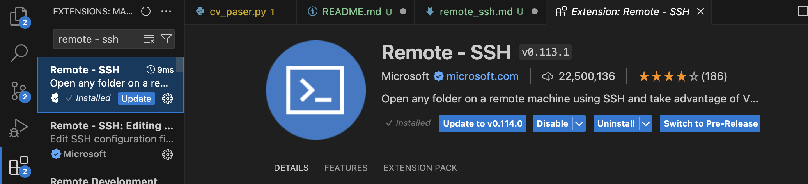

# ssh & remoute dev 

### Создаем ключик 

`ssh-keygen -t rsa`

Ключики кладется в `~/.ssh/` . Дайте говорящее название, например,  `id_itmo_team` .

 
`/home/username/.ssh/id_rsa` ->  `/home/username/.ssh/id_itmo_team`

Создасться пара публичный `/home/username/.ssh/id_itmo_team.pub` + приватный `/home/username/.ssh/id_itmo_team`


---
### Ложим на сервер публичный ключик 

Теперь заходим на сервер по паролю. username свое указывайте, ip - тут свежее, может меняться, пингуйте

username: vova, nastya, yarik, denis, naumtsevaleksandr

`ssh -o PreferredAuthentications=password denis@51.250.35.186`


теперь создайте папку `~/.ssh`

`mkdir ~/.ssh`

Создайте `~/.ssh/authorized_keys` и вставитье туда свой публичный ключ `/home/username/.ssh/id_itmo_team.pub`

`nano ~/.ssh/authorized_keys` + вставить + сохранить

---
### Локально настраиваем config 

Чтобы можно было заходить по красоте `ssh itmo_team` + vs code remote_dev нужно: 

Создать и записать в файл. Незабывайте своего User записать

`nano ~/.ssh/config`

```
Host itmo_team
  HostName 51.250.35.186
  User denis
  IdentityFile ~/.ssh/id_itmo_team
```

Проверяем вход по `ssh`- должно работать

`ssh itmo_team`

--- 

### Удаленая разработка с помощью vscode

Устанавливаем расширение: Remote - SSH



Далее открываем появившуюся панельку с экраном (удаленным подключением)


Выбираем нужное подключение и мы внутри - разрабатываем как и локально! 

--- 

### PyCharm удаленный доступ 

Когда пробовал - не поравилось. Вот что говорит ChatGPT. Возмонжо проще загуглить. 


> Шаг 3: Настройка SSH-конфигурации в PyCharm

1. Откройте PyCharm.
2. Создайте новый проект или откройте существующий.
3. Перейдите в "Settings" или "Preferences" (File > Settings на Windows/Linux или PyCharm > Preferences на macOS).
4. Перейдите в секцию Project: <your_project_name> > Python Interpreter.
5. Нажмите значок шестеренки рядом со списком интерпретаторов и выберите Add Remote Interpreter.

> Шаг 4: Настройка SSH-подключения

1. В открывшемся окне выберите SSH Interpreter и нажмите Next.
2. Укажите:
   - Host: IP-адрес или доменное имя удаленного сервера.
   - Port: По умолчанию 22.
   - Username: Имя пользователя на удаленном сервере.
3. Нажмите Next.
4. Выберите способ аутентификации:
   - Если вы используете пароль, укажите его.
   - Если вы используете SSH-ключ, выберите ваш приватный ключ (например, ~/.ssh/id_rsa).
5. Нажмите Next и дождитесь проверки соединения.
6. Выберите расположение интерпретатора Python на удаленном сервере, если он уже установлен, или укажите команду для его установки.

> Шаг 5: Синхронизация вашего проекта

После настройки интерпретатора PyCharm предложит синхронизировать ваши файлы между локальной и удаленной машинами:

1. Перейдите в Tools > Deployment > Configuration.
2. Нажмите значок +** для добавления нового сервера и выберите SFTP**.
3. Укажите имя сервера и заполните поля:
   - SFTP host: IP-адрес или доменное имя удаленного сервера.
   - Port: 22
   - Root path: Укажите путь на удаленном сервере, где будет работать ваш проект.
   - User name: Имя пользователя.
   - Authentication: Выберите способ аутентификации (пароль или SSH-ключ).
4. Протестируйте соединение, нажав Test Connection.
5. Перейдите на вкладку Mappings и укажите:
   - Local path: Путь к вашему проекту на локальной машине.
   - Deployment path: Путь на удаленной машине.
6. Нажмите OK, чтобы сохранить настройки.

### Шаг 6: Использование удаленного интерпретатора

Теперь, когда конфигурация завершена, вы можете использовать удаленный интерпретатор для запуска, отладки и выполнения своего проекта прямо из PyCharm:

1. Перейдите в Run > Edit Configurations.
2. Выберите или создайте новую конфигурацию запуска вашего проекта.
3. Убедитесь, что в качестве интерпретатора выбран удаленный интерпретатор.
4. Сохраните изменения.

### Заключение

Теперь ваш PyCharm настроен для удаленной разработки. Вы можете редактировать файлы в локальной машине, а запускать и отлаживать их на удаленном сервере. Это позволяет вам пользоваться мощностью удаленной рабочей станции или сервера, оставаясь при этом в привычной интерфейсе PyCharm.
